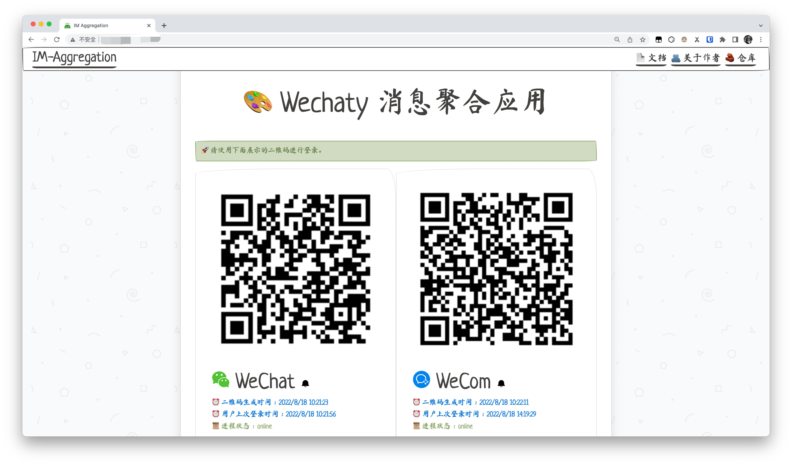
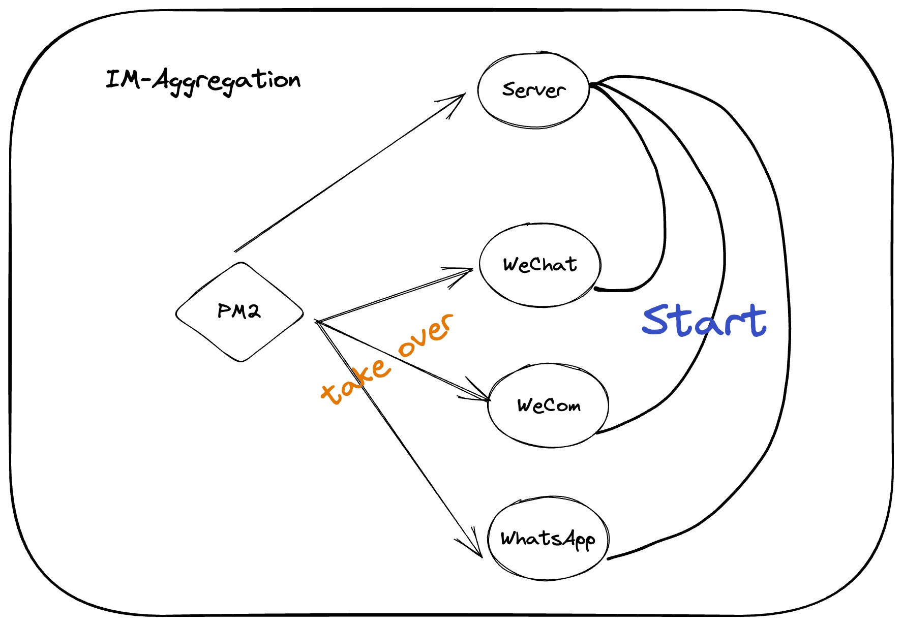
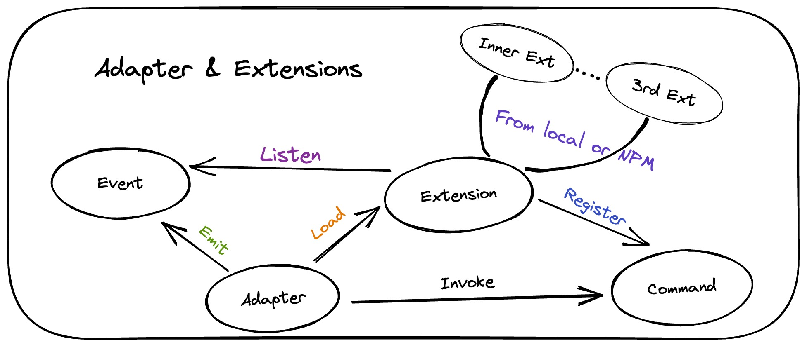

<h1 align="center">IM Aggregation</h1>

<h3 align="center">Powered By Wechaty</h3>

<h5 align="center"><a href="./README.md">English</a> | 简体中文</h5>

### Wechaty 消息聚合是什么？

这个项目的目标是将多个不同即时通讯应用中收到的消息聚合到某个指定的应用，例如将 WhatsApp 和企业微信收到的消息转发到微信中。本项目提供方便快捷的 docker 部署方式，并且你也可以根据自己的实际需求进行手动源代码部署。

### 直观的可视化管理界面



本项目提供了一个简洁的管理页面用于控制各个即时通讯应用的进程，以及通过扫描二维码的形式登录你的即时通讯应用账户

### 部署应用

本项目推荐使用 docker 进行部署，并且提供了 arm64 和 amd64 两种平台的镜像包，方便用户在服务器或者个人电脑（在 Apple Silicon 平台上依然适用）上部署。

部署的第一步，先把最新的 docker image 拉到本地。

```bash
docker pull tanknee/im-aggregation:latest
```

下载完成之后，你还需要准备一份环境变量文件，用于项目启动的一些配置：

```bash
WECHATY_PUPPET_SERVICE_NO_TLS_INSECURE_CLIENT=true

WECOM_TOKEN=

WECHAT_TOKEN=

# donut, padlocal e.g. 
WECHAT_TOKEN_TYPE=padlocal


LANGUAGE=zh

DOWNLOADS_FOLDER=downloads

OUTPUT_FOLDER=output

# WeCom gif storage.
STORAGE_TYPE=qiniu

QINIU_ACCESS_KEY=

QINIU_SECRET_KEY=

QINIU_BUCKET=

QINIU_ENDPOINT=
```

>   注意，如果要使用 WeCom（企业微信），为了保证功能的完整，请前往七牛云申请一个存储桶，并将相应的配置写入环境变量文件。

然后在本地创建如下几个文件夹，用于挂载程序运行时产生的配置文件。

```bash
mkdir ~/im-aggregation
mkdir ~/im-aggregation/log
```

最后，请使用如下命令启动容器。

```bash
docker run --name im -it -d --env-file .env -p 23333:7777 -v ~/im-aggregation/log:/root/.pm2/logs tanknee/im-aggregation:latest
```

-   `--name im` : 设置容器的名字为`im`。
-   `-it -d` : 让容器在后台运行。
-   `--env-file .env` : 导入环境变量文件，文件名为`.env`
-   `-p 23333:7777` : 导出端口。第一个数字是主机的端口，第二个是镜像中服务器端口。
-   `-v ~/im-aggregation/log:/root/.pm2/logs` : 把目录文件的路径挂载到本地。
-   `tanknee/im-aggregation:latest` : docker image 的名字。

### 开发应用

本项目是 node.js 项目，主体使用 typescript 进行开发，并使用 yarn 作为 node 包管理工具，因此在进行开发之前请确保对应的开发包已存在于环境中。

#### 环境要求

-   yarn
-   node （最好大于16.x）
-   redis（用于进程间通讯）
-   ts-node
-   puppet 所需要的依赖
-   build-essential

#### 环境变量

由于项目使用 `dotenv` 来读取环境变量，因此在启动项目之前，请填好上文提供的环境变量模板，放到项目的根目录。

安装项目依赖。

```bash
yarn
```

然后运行初始化脚本，用于生成数据库和一些配置文件。

```bash
bash init.sh
```

### 项目结构图

#### 顶层结构图

项目使用 pm2 进行 node 进程管理，通过一个服务器进程来监听来自用户的控制操作，并以此来启动对应的适配器进程。



#### 适配器结构图

下图是项目中适配器的结构图，适配器将会从本地或者网络上加载拓展，加载之后会让拓展注册一些指令，用户可以通过交互式命令来调用这些指令。另外适配器还会在运行过程中发布一些可监听的事件，让拓展可以在事件发生时进行一些对应的处理。

