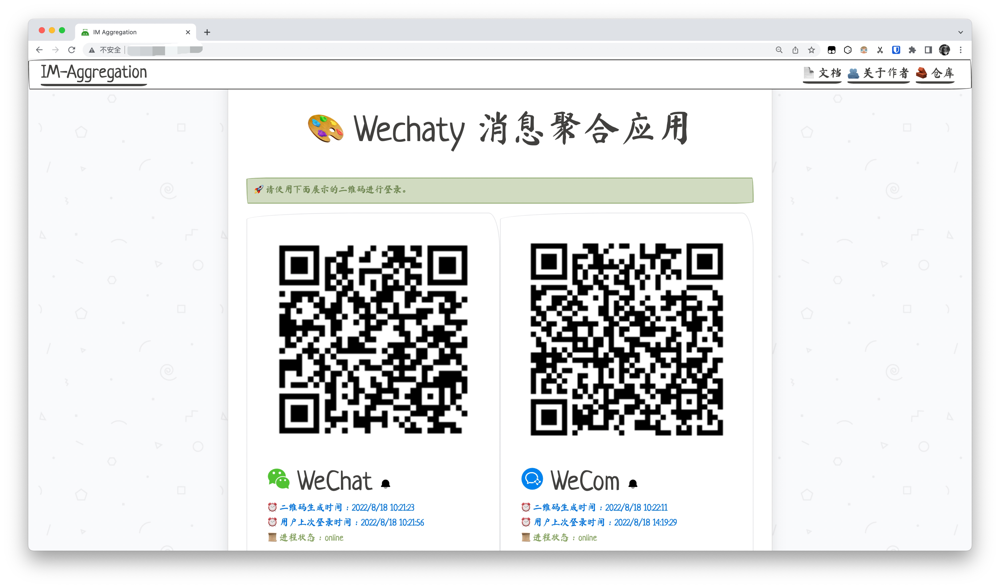
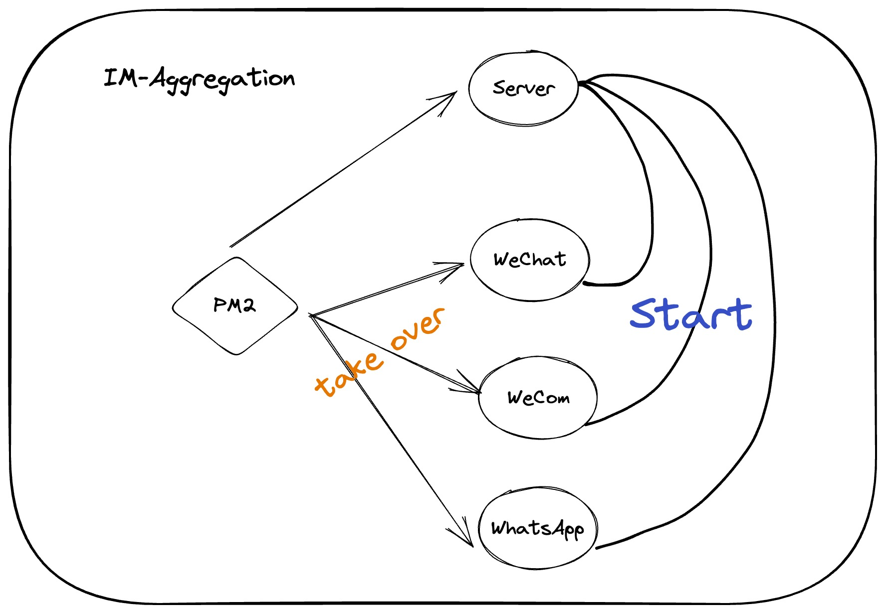

<h1 align="center">IM Aggregation</h1>
<h3 align="center">Powered By Wechaty</h3>

<h5 align="center">English | <a href="./README-zh.md">简体中文</a></h5>

### What is Wechaty IM Aggregation？

This is a project aimed at aggregating messages from multiple im applications, WeCom, WeChat or WhatsApp. You can set up our program by docker easily or clone the repository and run the code manually.

### Simple Management



We provide a simple management page for you to control the Wechaty robot process and your IM account's login status.

After you start the Wechaty robot process, handing up your cellphone and scanning the qrcode by the corresponding app. After a short wait, your account will be taken over by Wechaty.

### Deployment

We recommend you deploy im-aggregation through docker and our docker image have supported amd64 and arm64 so you can run this image easily.

First of all, you should pull the image.

```bash
docker pull tanknee/im-aggregation:latest
```

After downloading, you should prepare a env file likes this:

```bash
WECHATY_PUPPET_SERVICE_NO_TLS_INSECURE_CLIENT=true

WECOM_TOKEN=

WECHAT_TOKEN=

# donut, padlocal e.g. 
WECHAT_TOKEN_TYPE=padlocal


LANGUAGE=zh

DOWNLOADS_FOLDER=downloads

OUTPUT_FOLDER=output

# WeCom gif storage.
STORAGE_TYPE=qiniu

QINIU_ACCESS_KEY=

QINIU_SECRET_KEY=

QINIU_BUCKET=

QINIU_ENDPOINT=
```

> Note that if you want to use WeCom, in order to ensure the completeness of the function, go to Qiniu Cloud to apply for a bucket and write the corresponding configuration to the environment variable file.

Creating some folder to mount docker logs.

```bash
mkdir ~/im-aggregation
mkdir ~/im-aggregation/log
```


The last one, run the following script to start a docker container.

```bash
docker run --name im -it -d --env-file .env -p 23333:7777 -v ~/im-aggregation/log:/root/.pm2/logs tanknee/im-aggregation:latest
```

-   `--name im` : set container name.
-   `-it -d` : set docker run in background.
-   `--env-file .env` : import a env file which is named .`env`
-   `-p 23333:7777` : export port. the first number is host's port and the second one is Server port.
-   `-v ~/im-aggregation/log:/root/.pm2/logs` : mount program log to local path.
-   `tanknee/im-aggregation:latest` : docker image's name.

### Development

IM-Aggregation is a node project, it's node packages are managed by yarn tool, so before you download the code, you'd better install the yarn cli. 

#### Requirement

-   yarn
-   node (16.x is recommended)
-   redis
-   ts-node
-   puppet's dependency
-   ffmpeg
-   build-essential

#### ENV Requirement

Before you set up the code, you should create a file named `.env` in the root path of project, because our program use dotenv to manage env variable.

Then, you should install the dependency.

```bash
yarn
```

The second step is run the initial script:

```bash
bash init.sh
```

### Project Diagram

#### Top Structure Diagram

Here is the top structure of our program, we use pm2 to manage our progress. Server process offer you a simple ui to start or stop adapter process.



#### Adapter Structure Diagram

This is the structure of adapter, the adapter object will load extensions from local or network. Then, extension resgister some commands in adapter object, these commands will be invoked by user input. What's more, adapter also emit some important events (message, error etc.) for the listeners that registered in adapter.


